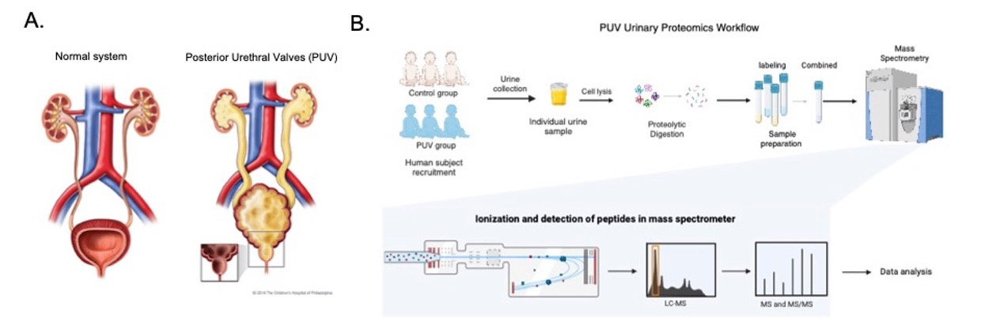
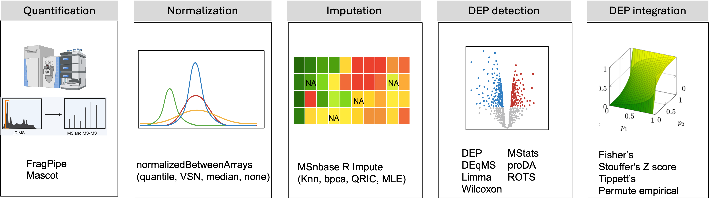

# Optimized differential expression analysis of the Urine Proteome in Boys with Posterior Urethral Valves 
## Introduction
Posterior urethral valves (PUV) represent the most common cause of congenital bladder outlet obstruction and a major etiology of end stage kidney disease (ESKD) in boys. Posterior urethral valves (PUV) occur in 1 in 4000 live male births and represent a leading cause of pediatric chronic kidney disease (CKD) and end stage kidney disease. There are knowledge gaps about the pathogenesis of kidney and urinary tract injury in PUV, along with an urgent need for prognostic biomarkers to identify boys with PUV who are at risk for deterioration in estimated glomerular filtration rate (eGFR) and progression to ESKD. In this pilot study, we defined the urine proteome in a cohort of 20 boys with PUV compared to 20 unaffected controls and the impact of eGFR variation within the PUV group on urine protein signatures.

# Patient recruitment
After obtaining Institutional Review Board (IRB) approval (IRB18-00695) and informed consent/assent, urine samples were collected from 20 boys with clinically proven PUV (cases) and 20 age- and sex-matched controls. Cases were recruited from our multispecialty clinic. Most boys were able to provide a voided sample (17/20), while two required a bag and one was collected at cystoscopy. Two of the patients were managed with incontinent diversions at the time of urine collection (one vesicostomy and one cutaneous ureterostomy). No patient was on clean intermittent catheterization at the time of sample collection. Healthy controls were recruited from the general pediatric clinic at the time of a well child check or non-urologic complaint. Any child with a history of a known urologic condition was excluded. Control urine was collected by volitional voiding or urine bag only. 

# Description
Proteomic profiling was performed using urine samples collected from 40 boys, encompassing 20 cases with PUV and 20 unaffected, age-matched controls. Among cases, the median ± interquartile range for eGFR was 89 ± 41 ml/min/1.73 m2. Urine samples were subjected to liquid chromatography with tandem mass spectrometry (LC-MS/MS).

# Methods
To detect the differentially expressed urinary proteins, , we implemented a comprehensive integrative approach by utilizing eight distinct analytical workflows. These included Limma, Wilcoxon test, DEP, proDA, ROTS, DEqMS, and MSstats—all applied using FragPipe-derived protein intensity data.

    1. Detection of differentially expressed proteins between cases and controls.
    2. Detection of differentially expressed proteins between normal eGFR versus controls 
    3. Detection of differentially expressed proteins between low eGFR versus cases with normal eGFR
    4. Detection of differentially expressed proteins between low eGFR versus cases with controls
    5. Pathway and functional enrichment of each categories

   

## Copyright
For more detail information, please feel free to contact: xin.wang@nationwidechildrens.org

Copyright (c) 2025 Xin Wang

Current version v1.0
